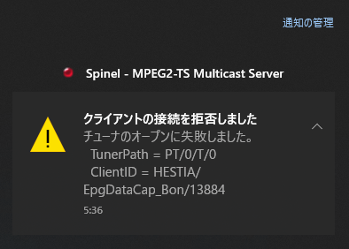
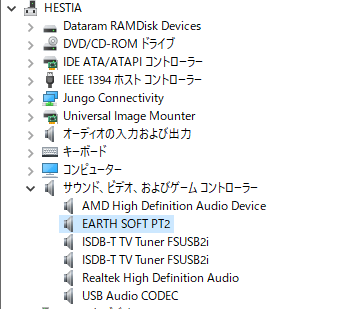
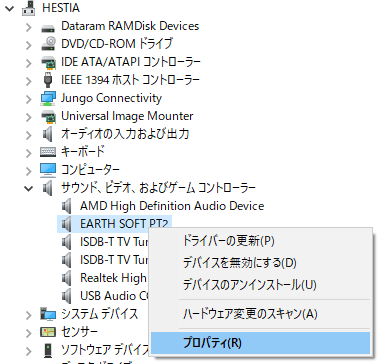
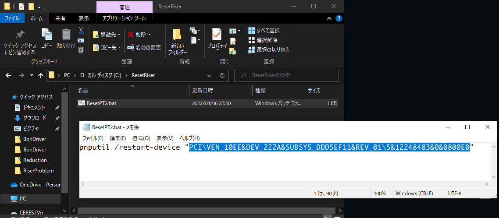
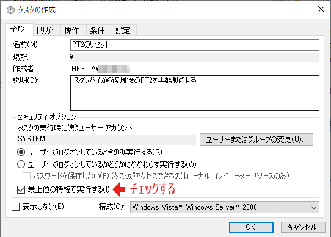
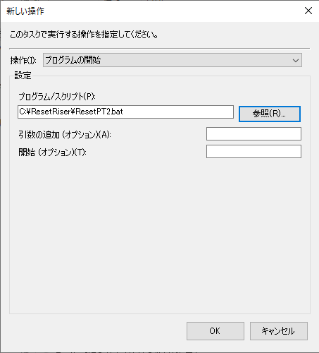

# ● システム復帰時ライザー経由PT2認識不良の自動修復

システムサスペンド状態から復帰したライザー経由で設置したPT2デバイスを開こうとするとエラーを表示することがある。



BIOS側がライザーを事前に把握していない環境では、PCIブリッジのライザー下の初期化に時間がかかるデバイスをすっ飛ばすことで起こる可能性の高い事案であると予測できる。
なので、システム復帰時にそのすっ飛ばされたデバイス(PT2)を再認識させて改修することについてまとめてみることにしてみた。

まず、デバイスマネージャを開く。
左下のルーペマークをクリックして検索欄に"デバイス"と入力して"開く"を選択。


"サウンド、ビデオ、およびゲームコントローラー" 欄に "EARTH SOFT PT2" が居る事を確認。



"EARTH SOFT PT2" を選択して右クリックしてスピードメニューから "プロパティ" を選択。



プロパティ画面が開いたら、上のタブから "詳細" を選択し、プロパティ欄から "デバイスインスタンスパス" を選択し、表示された値欄を右クリックしてスピードメニューから "コピー" を選択。


Cドライブのルートに "ResetRiser" フォルダを作成し、そのフォルダーの中に "ResetPT2.bat" を作成する。



ResetPT2.bat の中身は下記の様に記述する。
```sh
pnputil /restart-device "<先程コピーした EARTH SOFT PT2 のデバイスインスパスをココへペースト>"
```
上記は、応答不能になったデバイスを再始動するコマンド。
これをシステム復帰時毎に起動することを目的にタスクスケジューラに登録する。

タスクスケジューラを開く。
左下のルーペマークをクリックして検索欄に"PC"と入力して"管理"を選択。


システムツール > タスクスケジューラ > タスクスケジューラライブラリ を選択。
右側の操作欄から "タスクの作成" をクリック


タスクの作成が表示されたら"全般" 欄が表示されていると思うので、下記のように編集する。
- 名前: ``` PT2のリセット ```
- 説明: 適当(``` PT2スタンバイ復帰処理 ```等)
- **最上位の特権で実行する**にチェック



次に、"トリガー" 欄を上のタブから選択し、"新規" をクリック。


新しいトリガーが表示されたら、下記のように編集して、"OK" ボタンをクリックして画面を閉じる。
- タスクの開始: ``` イベント時 ```
- ログ: ``` システム ```
- ソース: ``` Power-Troubleshooter ```
- イベントID: ``` 1 ```
- **遅延時間を指定する**をチェックして ``` 20 秒間 ``` にセット


すると、サスペンドからのシステム復帰時20秒後に発動するトリガーがこのように登録される。


次に、"操作" 欄を上のタブから選択し、"新規" をクリック。


新しい操作が表示されたら、"プログラム／スクリプト" 欄に先程作成したバッチファイルのパス ``` C:\ResetRiser\ResetPT2.bat ``` を書いて、"OK" ボタンをクリックして画面を閉じる。



すると、トリガー時(サスペンドからの復帰時)に自動的に開始されるプログラムとして "C:\ResetRiser\ResetPT2.bat" がこのように登録される。


"OKボタン" を押すとこのように "PT2のリセット" がタスクとして登録され、システム復帰時毎にPT2デバイスの再始動が以後、自動的に行われるようになる。


筆者の環境では、ASM1083チップを搭載したライザーカード経由でPT2を動作させているのですが、このタスクを登録してからは、システム復帰時にPT2デバイスを見失うことはなくなりました。

*※ pnputil /restart-device コマンドは、Windows10 2004 以降の環境が必要なことに注意。*

以上ノシ
